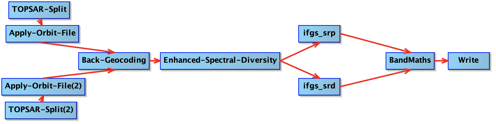

# Calculation of the height-to-phase (h2ph) factor

Graphical representation of the Graph ([Height-to-phase.xml](./Height-to-phase.xml)), as drawn with the SNAP Graph Builder:

## Steps

Steps are analogous to the ones from [`TOPSAR-Coreg-Interferogram`](../TOPSAR-Coreg-Interferogram) up to `Enhanced-Spectral-Diversity`.

From there:
* Two interferograms are computed:
  * `ifgs_srp` (= subtracted reference phase, computed with flat Earth phase = true)
  * `ifgs_srd` (= subtracted reference phase, computed with flat Earth phase = true and topographic phase = true)
* `BandMaths`: this operator calculates the h2ph factor from the computed interferograms. For more information on how the factor is computed, see [this comment](https://github.com/TUDelftGeodesy/snap-coregistration/issues/3#issuecomment-2877881956).
* `Write`: the h2ph factor is written to disk

Note that the script/graph also include functionality to write out the interferograms for debugging/validation. For this purpose, the Pyhon script in this folder ([`check_h2ph.py`](./check_h2ph.py)) calculates the h2ph factor from the interferograms and compares it to the h2ph factor computed via SNAP/GPT.

## Files

* SLURM batch file: [Height-to-phase.bash](./Height-to-phase.bash)
* Properties (parameter) file: [Height-to-phase.properties](./Height-to-phase.properties)
* Graph XML file: [Height-to-phase.xml](./Height-to-phase.xml)
* Python script for validation: [`check_h2ph.py`](./check_h2ph.py)
