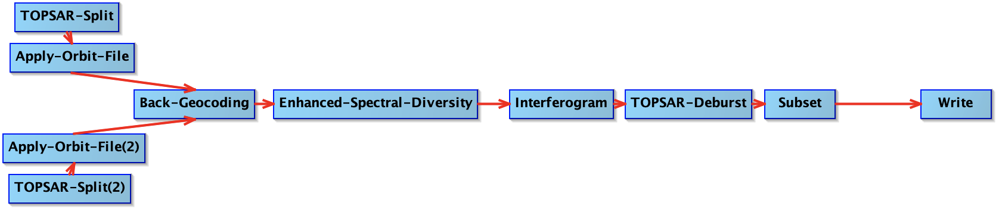

# TOPSAR Coregistration and Interferogram 

Graphical representation of the Graph ([TOPSAR-Coreg-Interferogram.xml](./TOPSAR-Coreg-Interferogram.xml)), as drawn with the SNAP Graph Builder:

## Steps

* `TOPSAR-Split`: Select polarization, subswaths and bursts to work on. The geometry of the area of interest (AoI) can be provided to select the interrelevant bursts, **but only one subswath can be selected**. If the AoI covers multiple subswaths, the coregistration/interferogram calculation need to be run separately for each of the subswaths. Note that the following steps will run on full bursts intersecting the AoI - the actual cropping happens at the very last step (`Subset`).
* `Apply-Orbit-File`: Download precise orbit data (if not available, restituted orbits are used).
* `Back-Geocoding`: Run coregistration of the two (selection) scenes. A DEM data is downloaded (or a local one can be used).
* `Enhanced-Spectral-Diversity`: Run the Network Enhanced Spectral Diversity (NESD) algorithm for TOPS coregistration.
* `Interferogram`: Calculates the interferogram.
* `TOPSAR-Deburst`: Merge the selected bursts into a raster image, dropping overlaps. **It fails if the workflow acts on a single burst**.
* *(not implemented)* `TOPSAR-Merge`: Debursted interferograms from different subswaths can be merged at this point.
* `Subset`: Crop the interferogram to the AoI.

## Files

* SLURM batch file: [TOPSAR-Coreg-Interferogram.bash](./TOPSAR-Coreg-Interferogram.bash)
* Properties (parameter) file: [TOPSAR-Coreg-Interferogram.properties](./TOPSAR-Coreg-Interferogram.properties) 
* Graph XML file: [TOPSAR-Coreg-Interferogram.xml](./TOPSAR-Coreg-Interferogram.xml)
